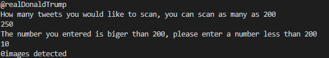
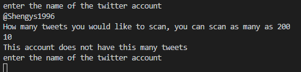
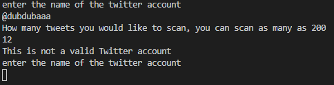
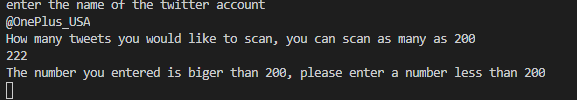
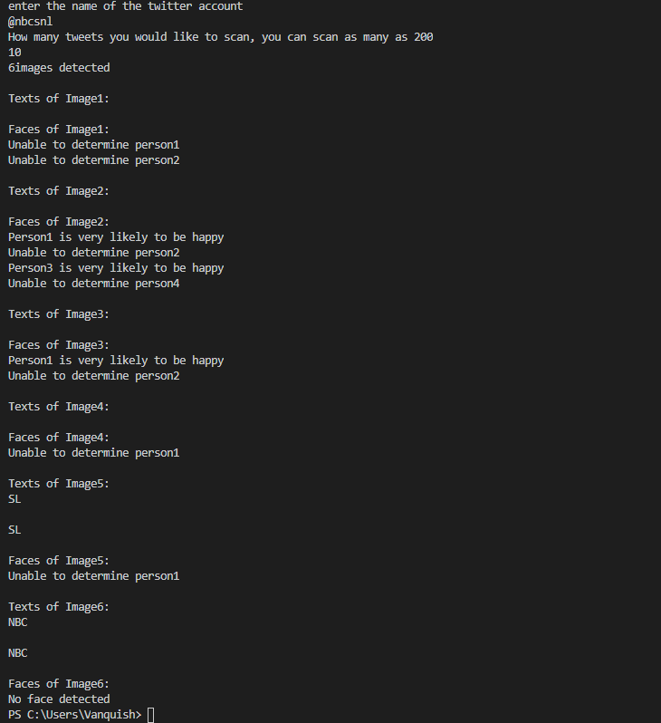

# Result
# This is the result when no image is detected

# This is the result when there aren't enough tweets to analyze(if the account only has 5 tweets and the user wants to analyze 10 tweets)

# This is the result when the account name does not exist

# This is the result when the user wants to analyze more than 200 tweets

# This is the result of a normal run

